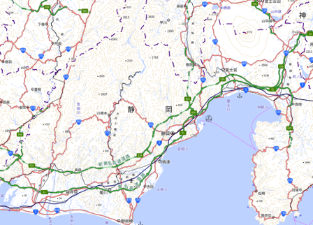

# 地理院地図Vector（仮称）で読み込めるスタイルのサンプル集

## 本レポジトリについて
本レポジトリでは、[地理院地図Vector（仮称）]( https://maps.gsi.go.jp/vector/)で読み込めるスタイルファイルのサンプルを提供しております。

以下のリンクを右クリックし、「名前をつけて保存」からダウンロードすることができます。
保存したファイルは、地理院地図Vectorの「地図デザインの追加」-「地図デザインファイルを開く」から読み込んで表示することができます。

### [軽い標準地図](https://github.com/gsi-cyberjapan/gsimaps-vector-stylesamples/data/light.json)
地理院地図Vectorの「標準地図」をベースに、道路・鉄道の立体交差の表現を行わないなど、できるだけシンプルなデザインとすることで、スタイルファイルの読み込み速度を「標準地図」より速めたスタイルです。

 

### [道路地図](https://github.com/gsi-cyberjapan/gsimaps-vector-stylesamples/data/road.json)
道路をほかの地物より目立たせて表示し、さらに道路の種類（高速道路、国道、都道府県道など）をわかりやすくしたスタイルです。

 

### [鉄道路線図](https://github.com/gsi-cyberjapan/gsimaps-vector-stylesamples/data/railway.json)
鉄道に関する情報だけを表示したスタイルです（ZL8～17では、参考として河川も表示しています）。

 

### [地形だけ地図](https://github.com/gsi-cyberjapan/gsimaps-vector-stylesamples/data/land.json)
道路や建物などを表示せず、山と山名、川と川名など、自然の地形の情報のみを表示したスタイルです。地形の学習の素材にオススメです。

 

### [川だけ地図](https://github.com/gsi-cyberjapan/gsimaps-vector-stylesamples/data/river.json)
地形だけ地図からさらに表示する地物を減らし、河川や湖などに関する情報のみを表示したスタイルです。

 

### [ひらがな地図](https://github.com/gsi-cyberjapan/gsimaps-vector-stylesamples/data/kana.json)
文字をひらがなで表示したスタイルです。ZL8～17にて文字がひらがなで表示されます。

 

- なお、地理院地図Vectorの「おすすめの地図」で選択できるスタイルファイルは、[地理院地図Vector（仮称）提供実験のレポジトリ](https://github.com/gsi-cyberjapan/gsimaps-vector-experiment/)をご覧ください。

## 履歴
- 2020-04-27 レポジトリ公開開始

